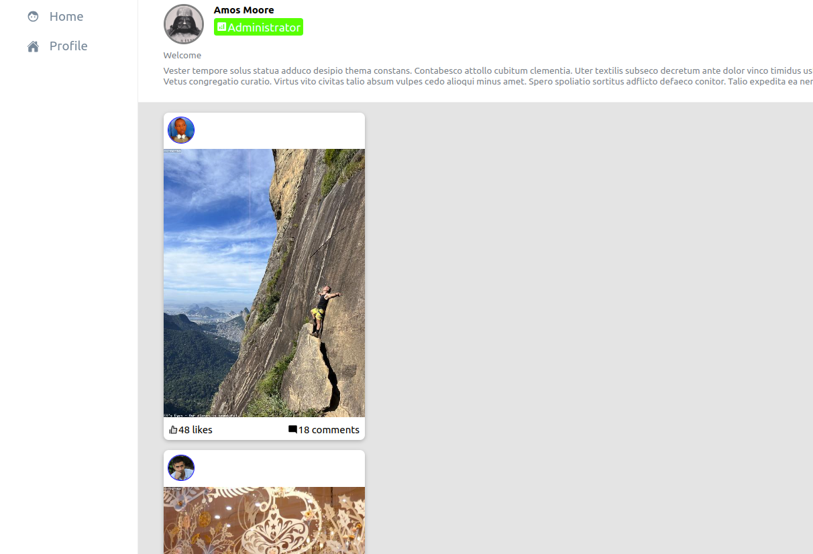
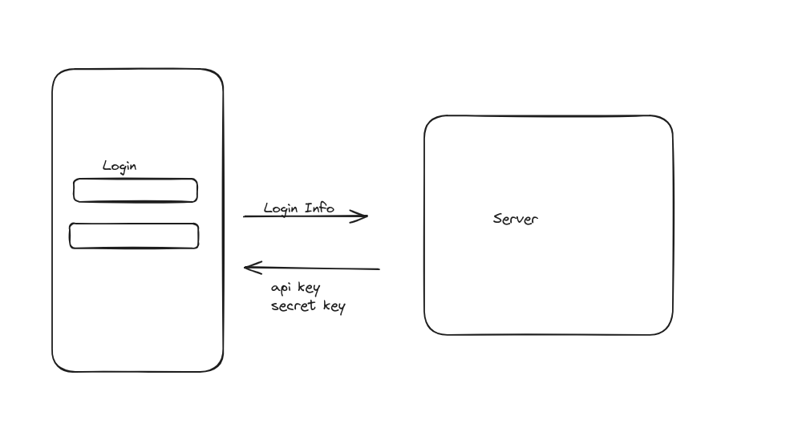

## shasa.thuo@gmail.com asessment for Productive Software
The asessment is a react app that lets users login and access hompage and profile page

- clone the repository and first install packages using the command `npm  i`
- after installing packages  start the app using the command `npm run dev`

### Technologies uses 
- react
- redux toolkit
- mirage js(for the mock server)
- faker js
- react-router
- typescript

## User Flow
log in with any credential, you will then be redirected to the homepage which shows info from various users, you can switch between homepage and profile page using the sidebar

### Screenshots
Log in Page

Homepage

## Api design
Login credentials are sent to the server which responds with api key and secret key, these are stored and used to authenticate any subsequent api requests
